# Тестовое задание для Hex-Team

- ##### [ссылка на хостинг](http://p91621ur.beget.tech/)

#### Запуск приложения из github:

1. Склонировать репозиторий с github
2. Открыть корневую папку в cmd / терминале
3. Ввести в терминале "npm i", нажать enter, дождаться установки всех node_modules
4. Ввести в терминале "npm run start", дождаться открытия владки браузера

#### Описание тестового задания

Тестовое задание представляет собой fronend-часть (сайт) сервиса сокращения ссылок. Основной функционал сервиса - получение по произвольной ссылке (например, https://docs.docker.com/engine/reference/commandline/attach/) короткой ссылки (https://front-test.hex.team/s/983ZV), реализующей перенаправление пользователя на исходную страницу. 

Пользователь должен мочь зарегистрироваться на сайте, авторизоваться, создать произвольное количество сокращенных ссылок и просматривать количество переходов по каждой из них.

Frontend может состоять из нескольких страниц (главное наличие функциональности):

- Страница регистрации;
- Страница авторизации;
- Основная страница, реализующая следующую функциональность:
  - Просмотр статистики по созданным ссылкам в виде таблицы;
  - Таблица содержит минимум три столбца - короткая ссылка, исходная ссылка, количество переходов по короткой ссылке;
  - Таблица должна иметь пагинацию, работающую на стороне сервера (общее количество записей в таблице передается в хэдере x-total-count) ;
  - Таблица должна иметь возможность сортировки по столбцам (в документации указаны столбцы, по которым можно сортировать);

Бонусом будет:

- Возможность сортировки по нескольким столбцам таблицы статистики одновременно
- Копирование сокращенных ссылок при клике
- Запуск через docker контейнер (docker-compose.yml)
- Развернутый сервер с вашим кодом в сети (необходимо указать ссылку в Readme.md)

#### Описание разработанного приложения

1. На начальной странице сайта предлагается зарегистироваться.

   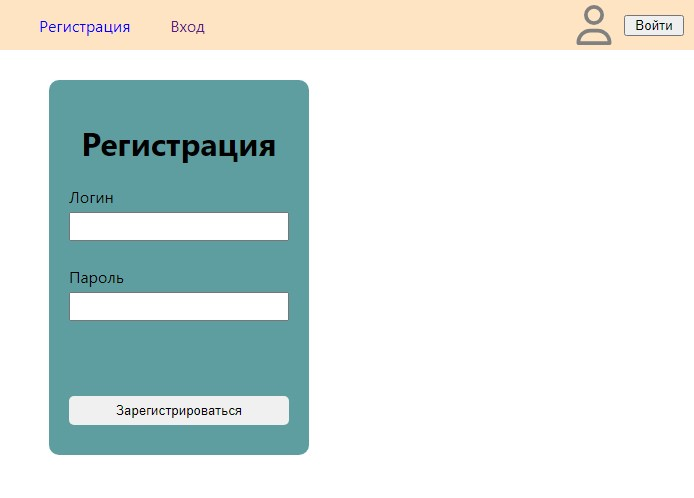

2. При ошибке регистрации - выводится соответствующее сообщение (зависит от ответа сервера).

   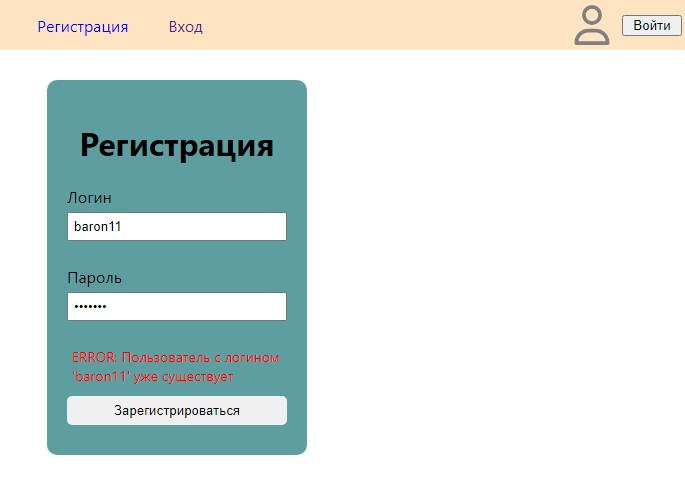

3. При успешной регистрации пользователь перенаправляется на страницу авторизации.

   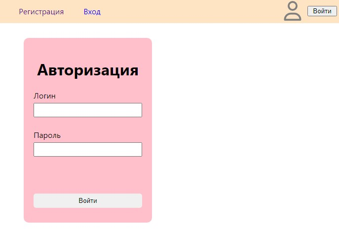

4. При незаполнении полей / другой ошибке - выводится соответствующее сообщение.

   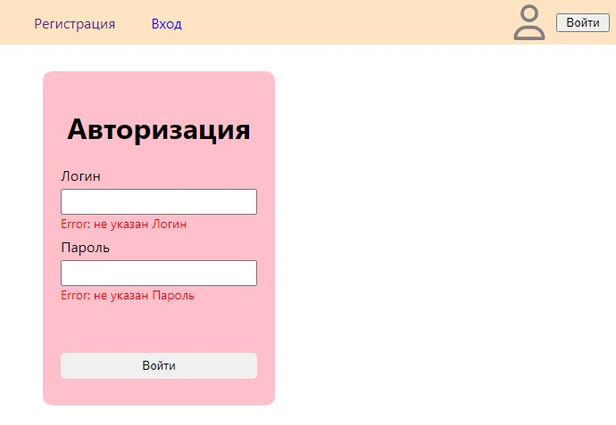

5. При успешном входе пользователь перенаправляется на страницу сокращения ссылок.

   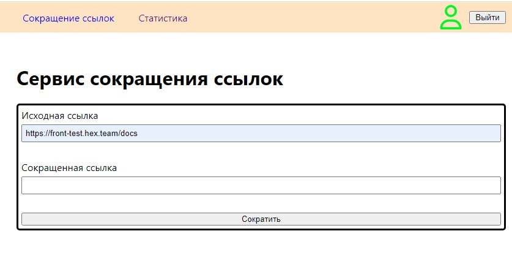

6. После нажатия кнопки "Сократить" - формируется сокращенная ссылка. Для копирования сокращенной ссылки достаточно нажать на поле с её значением.

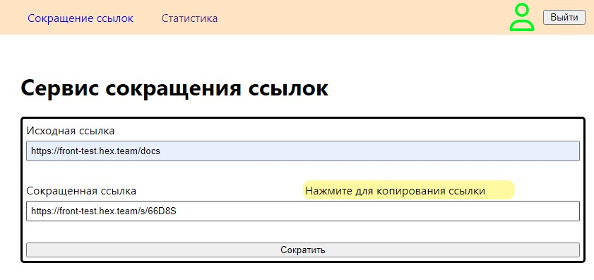

7. На странице "Статистика" формируется таблица с статистикой использования созданных сокращенных ссылок.

   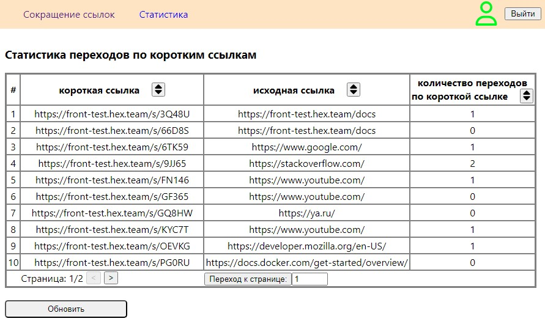

8. Для сортировки по столбцу - необходимо нажать на кнопку изменения сортировкив столбце, по которому будет производиться сортировка.

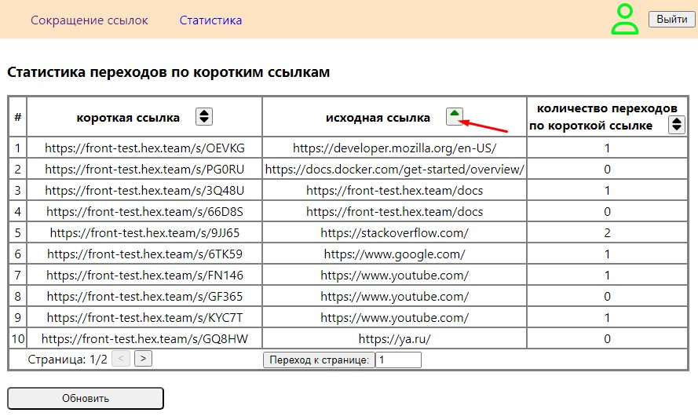

9. Для сортировки по двум столбцам необходимо нажать на такую же кнопку в другом столбце, чтобы по крайней мере в двух столбцах была не дефолтная сортировка, обозначаемая .

   Пример сортировки по двум столбцам: 

   - восходящая сортировка по исходной ссылке + восходящая сортировка по количеству переходов

   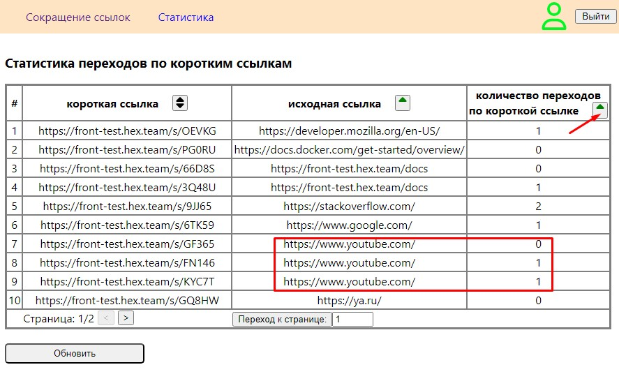

   - восходящая сортировка по исходной ссылке + нисходящая сортировка по количеству переходов

   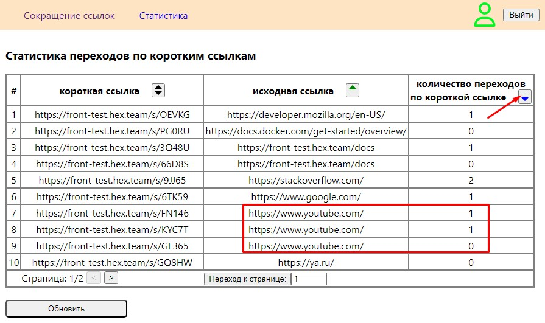

10. Для перехода на другую страницу есть два спобоба:

    1. переключить на следующую/предыдущую страницу (указано красным цветом) 
    2. указать необходимую страницу для перехода и нажать "Переход к странице" (указано синим цветом)

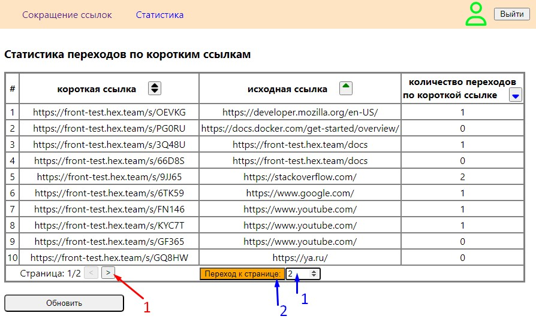

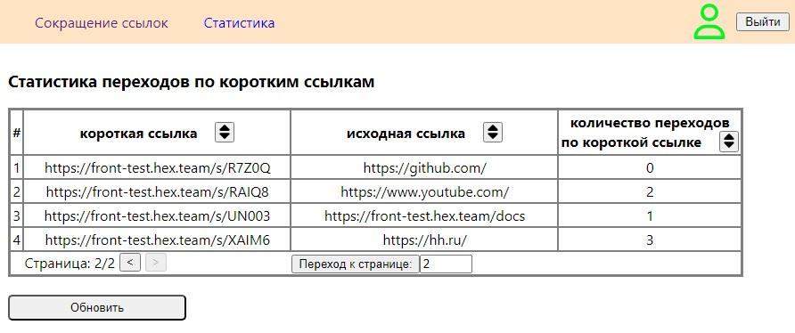

#### Примечание

После некоторого времени при обновлении страницы статистики пропадает привязка access_token к зарегистрированному пользователю - отображается либо пустая таблица, либо таблица с большим количеством ссылок. Это зависит от бэкенда. Для восстановления статистики пользователя - нужно перезайти на сайт с тем же логином.